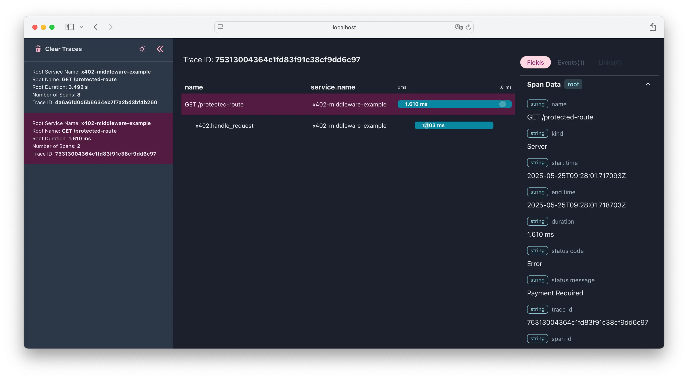
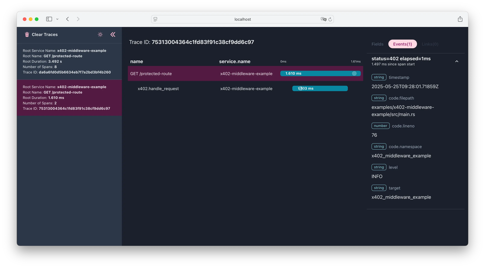
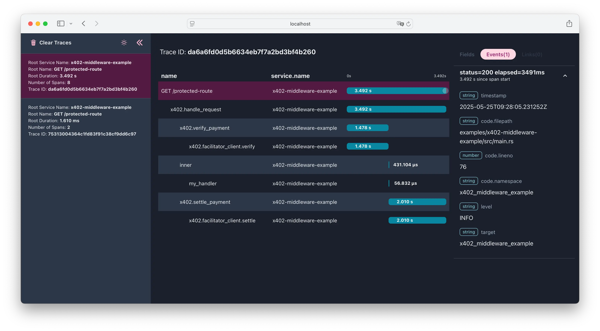

# x402-axum-example

An example Axum server demonstrating how to protect routes using the [`x402-axum`](https://crates.io/crates/x402-axum) crate
and enforce payments using the [x402 protocol](https://www.x402.org).

This example shows how to:
- Configure a remote facilitator for payment verification and settlement.
- Gate access to an API endpoint using the [`x402-axum`](https://crates.io/crates/x402-axum) middleware
  that requires on-chain payment before responding.
- Enable structured logging and distributed tracing using `tracing` and OpenTelemetry to observe what's happening inside the middleware.

## What’s Included

- **Axum setup**
  - Defines the protected route with a `GET /protected-route` handler.
- **x402 middleware usage**
  - Applies a `price_tag` (combination of payment address, asset, and required amount) requesting 0.025 USDC on the Base Sepolia testnet.
  -	Adds human-readable metadata via `.with_description(...)` and `.with_mime_type(...)`.
-	**Tracing setup**
  - HTTP-level tracing via `tower_http::trace::TraceLayer` 
  - OpenTelemetry integration via `x402_rs::telemetry::Telemetry`
  -	Rich per-request spans that capture method, URI, latency, status, and middleware internals.

## Prerequisites

- Rust 1.76+ (Rust 2024 Edition)
- A running x402 facilitator (this example uses [https://facilitator.ukstv.me](https://facilitator.ukstv.me))
- Optional `.env` file to configure OpenTelemetry endpoint

## Try It

```bash
git clone https://github.com/x402-rs/x402-rs x402-rs
cd x402-rs/examples/x402-axum-example
cargo run
```

The server will start on http://localhost:3000 and exposes a protected route at `GET /protected-route`.

The route is protected by x402 middleware and requires a valid x402 payment.
If no valid payment is provided, the server responds with a 402 Payment Required status and detailed requirements.

**Example (Request without payment):**
```bash
curl http://localhost:3000/protected-route
```
```json5
// HTTP/1.1 402 Payment Required
// Content-Type: application/json
// ...
{
  "error": "X-PAYMENT header is required",
  "accepts": [
    {
      "scheme": "exact",
      "network": "base-sepolia",
      "maxAmountRequired": "2500",
      "resource": "https://localhost:3000/protected-route",
      "description": "Premium API",
      "mimeType": "application/json",
      "payTo": "0xBAc675C310721717Cd4A37F6cbeA1F081b1C2a07",
      "maxTimeoutSeconds": 300,
      "asset": "0x036CbD53842c5426634e7929541eC2318f3dCF7e",
      "extra": {
        "name": "USDC",
        "version": "2"
      }
    }
  ],
  "x402Version": 1
}
```

**Example (Request with payment):**

If you use an x402-compatible client like [`x402-fetch`](https://www.npmjs.com/package/x402-fetch),
it will automatically perform payment (e.g., 0.0025 USDC) before fetching http://localhost:3000/protected-route, and receive the protected response.

<details>
<summary>Example JS code to access a paid endpoint</summary>

```typescript
import { createWalletClient, http } from "viem";  // https://viem.sh/
import { privateKeyToAccount } from "viem/accounts";
import { baseSepolia } from "viem/chains";
import { wrapFetchWithPayment } from "x402-fetch"; // https://www.npmjs.com/package/x402-fetch

// Create a wallet client
const account = privateKeyToAccount("0xYourPrivateKey");
const client = createWalletClient({
  account,
  transport: http(),
  chain: baseSepolia,
});

// Wrap the fetch function with payment handling
const fetchWithPay = wrapFetchWithPayment(fetch, client);

// Make a request that may require payment
const response = await fetchWithPay("http://localhost:3000/protected-route", {
  method: "GET",
});

const data = await response.json(); //=> { "hello": "paid-content" }
```
</details>

## Telemetry

To enable tracing, configure OpenTelemetry using environment variables.
For use with local [OpenTelemetry Desktop Viewer](https://github.com/CtrlSpice/otel-desktop-viewer) create a `.env` file:

```dotenv
OTEL_EXPORTER_OTLP_ENDPOINT="http://localhost:4318"
OTEL_TRACES_EXPORTER="otlp"
OTEL_EXPORTER_OTLP_PROTOCOL="http/protobuf"
```

With telemetry enabled, traces will include spans like:
- `x402.handle_request`, 
- `x402.verify_payment`, 
- `x402.facilitator_client.verify`.

These can be visualized in tools like Jaeger, Tempo, or Grafana.

<details>
<summary>See how x402 traces look in the OpenTelemetry Desktop Viewer</summary>

- **Payment Required:** Request received without payment, and the middleware returned a `402 Payment Required` response:

  

  Note how the span includes a `status=402` event emitted by the middleware:

  

- **Payment Accepted:** A valid x402 payment was provided; the middleware allowed the request and settled the payment:

  

  The span includes an event showing `status=200`:

  

</details>

## Related Crates
- [`x402-axum`](https://crates.io/crates/x402-axum) – Axum middleware used in this example.
- [`x402-rs`](https://crates.io/crates/x402-rs) – Core x402 protocol types, client traits, and utilities.

## License

[Apache-2.0](LICENSE)
